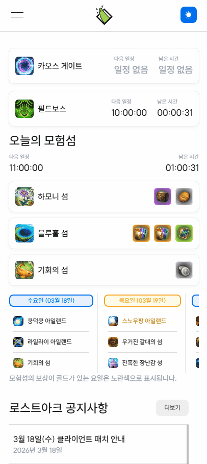
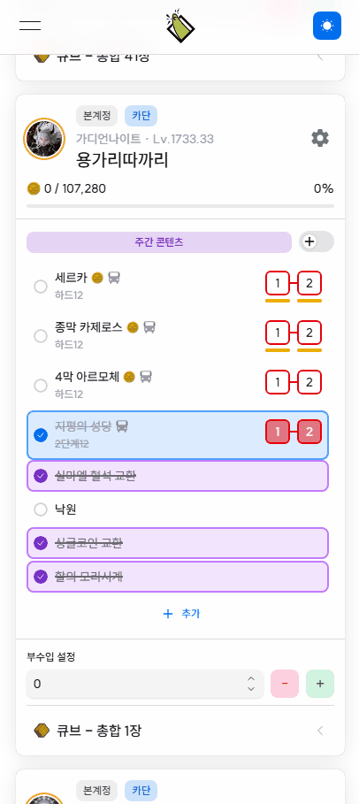
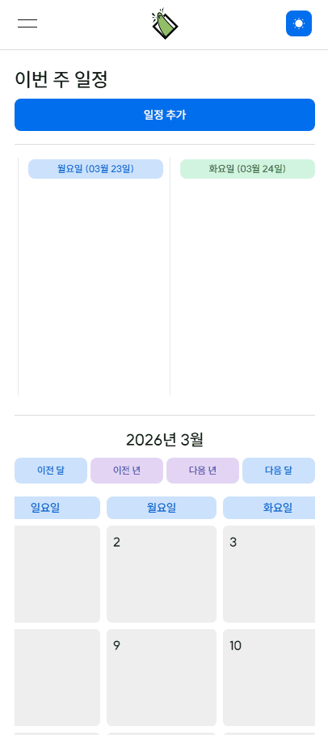
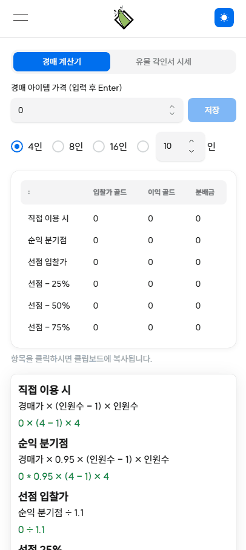

# 로츠고(Lot's Go) - 로스트아크 숙제, 정보 및 일정 관리
로스트아크 플레이에 도움이 되는 숙제 체크, 일정 관리, 게임 내 콘텐츠 일정과 이벤트, 공지 확인, 레이드 파티 시스템을 구현한 웹 서비스

## 📑 프로젝트 소개

**로츠고(Lot's Go)**는 로스트아크 유저의 숙제와 일정, 레이드 관리를 지원하는 웹 서비스입니다.  
여러 캐릭터를 동시에 육성하면서 발생하는 숙제 관리의 불편함을 해결하기 위해 개발되었으며, 게임 외부에서도 진행 상태를 확인하고 관리할 수 있도록 설계되었습니다.  
**일일/주간 숙제 추적, 일정 관리, 레이드 파티 기능**을 통해 플레이 흐름을 보다 효율적으로 정리할 수 있습니다.

## 🔥 주요 기능

  
<b>📝 숙제 관리</b>

  <ul>
    <li>일일 / 주간 콘텐츠 숙제 체크</li>
    <li>06시 기준 자동 초기화 (일일 / 매주 수요일)</li>
    <li>콘텐츠 외 기타 숙제 커스텀 관리</li>
    <li>주간 총 재화 획득량 집계</li>
  </ul>

  
<b>📆 일정 관리</b>

  <ul>
    <li>레이드, 숙제, 개인 일정 등록 및 관리</li>
    <li>파티에 등록된 레이드 일정 관리</li>
    <li>특정 날짜에 해야 할 콘텐츠 및 숙제 통합 확인</li>
  </ul>

  
<b>🧔🏻 전투정보실 (캐릭터 조회)</b>

  <ul>
    <li>캐릭터 전투 정보 조회 (캐릭터 스펙, 특성 등)</li>
    <li>주요 정보를 한눈에 확인할 수 있는 시각화 UI 제공</li>
    <li>원정대 내 캐릭터 정보 통합 확인</li>
    <li>원정대 내 캐릭터 스펙 집계</li>
    <li>캐릭터 세팅 및 성장 상태를 빠르게 파악</li>
    <li>최신 정보 반영을 위한 데이터 동기화</li>
  </ul>

  
<b>👥 파티 모집</b>

  <ul>
    <li>고정 파티 일정 및 숙제 공유</li>
    <li>레이드 파티 생성 및 참여</li>
    <li>파티 일정 관리</li>
  </ul>

  
<b>🔧 도구</b>

  <ul>
    <li>경매 최적가 계산</li>
    <li>아이템 시세 조회</li>
    <li>시세 변동 분석</li>
    <li>레이드 참여 비용 계산</li>
  </ul>

  
<b>🫆 회원 데이터</b>

  <ul>
    <li>회원 가입 및 로그인 기능</li>
    <li>JWT 기반 인증 및 세션 관리 (refresh token)</li>
    <li>사용자 권한 및 접근 제어</li>
  </ul>

## 🎬 기능 미리보기
<table>
  <tr>
    <td align="center" width="25%"></td>
    <td align="center" width="25%"></td>
    <td align="center" width="25%"></td>
    <td align="center" width="25%"></td>
  </tr>
  <tr>
    <td align="center" width="25%"><b>로스트아크 정보</b></td>
    <td align="center" width="25%"><b>숙제 체크</b></td>
    <td align="center" width="25%"><b>숙제 추가</b></td>
    <td align="center" width="25%"><b>일정 관리</b></td>
  </tr>
  <tr>
    <td align="center" width="25%"></td>
    <td align="center" width="25%"></td>
    <td align="center" width="25%"></td>
    <td align="center" width="25%"></td>
  </tr>
  <tr>
    <td align="center" width="25%"><b>전투정보실</b></td>
    <td align="center" width="25%"><b>파티 레이드 추가</b></td>
    <td align="center" width="25%"><b>파티 레이드 관리</b></td>
    <td align="center" width="25%"><b>편의성 도구</b></td>
  </tr>
</table>

## 🧱 기술 스택
### 📌 프레임워크 & 언어

### 🎨 UI & 스타일링

### 📊 상태 & 데이터 관리

### 🗄️ 백엔드 / 인프라

### ⚙️ 유틸리티

### 🚀 배포 & 운영

## 🧠 아키텍처 설계

로츠고는 **Next.js 기반의 프론트엔드와 API Route**를 중심으로 구성되어 있으며, **Firebase**를 데이터 저장소로 이용하고 있고 자주 이용하는 데이터는 **Redis**를 통해 캐싱을 적용하여 성능을 최적화했습니다.  
사용자의 요청은 프론트엔드를 통해 서버로 전달되며, 서버는 Firebase 및 외부 로스트아크 API와 통신하여 데이터를 처리한 뒤 응답을 받습니다.  
또한 **Cloud Scheduler와 Cloud Functions**를 활용하여 일일 및 주간 숙제 초기화를 자동화하도록 설계하였습니다.

## ⚡ 성능 최적화
- **Redis 기반 캐시**를 적용하여 반복 조회 데이터의 응답 속도를 개선
- **cursor 기반 페이지네이션**을 도입하여 대량 데이터 조회 시 초기 로딩 부담 감소와 읽기 비용 감소
- **검색 전용 구조 및 인덱스**를 활용하여 닉네임/캐릭터 조회 성능 최적화
- 일괄 처리 작업에는 **batch 방식**을 적용하여 네트워크 요청 수와 처리 비용을 최소화
- 숙제 초기화 로직을 **스케줄러 기반**으로 분리하여 사용자 요청 시점의 서버 부담을 감소

## 🧪 문제 해결 경험
### 📌 문제 상황
초기 기획을 기반으로 개발을 진행하면서 아래와 같은 문제가 발생을 하였습니다.
- 개발 과정에서 데이터 구조와 기능이 지속적으로 변경됨.
- 초기에는 로그인 보안을 단순히 비밀번호 암호화 정도로 괜찮을거라고 판단
하지만 개발이 진행이 될수록 기능 확정에 따라 데이터 구조가 자주 변경이 되었고, 인증 방식이 단순할 경우 보안 취약점이 발생할 수 있음을 인지하였습니다.

### 🔍 원인 분석
- 확장성을 고려하지 않은 데이터 설계
- 인증 / 보안에 대한 이해 부족 (단순 암호화가 충분한 보안이라고 판단)
- 세션 관리 및 인증 흐름에 대한 설계 부재

### 🛠 해결 방법
1. 데이터 구조 개선 및 유연한 설계 적용
- Firestore 구조를 기능 단위로 분리하여 확장성 확보
- 앞으로 기능 확장에 대하여 데이터 필드 추가 / 변경에 유연하게 대응할 수 있도록 구조 리펙토링
- 기능 단위로 API 및 상태 관리 로직 분리

2. JWT 기반 인증 구조 도입
- 구조 변경
  - 기존 : **비밀번호 암호화 후 단순 로그인 유지 방식**
  - 개선 후 : **Access Token + Refresh Token 구조**
- 구현 방식
  - **Access Token**
    - 30분 짧은 만료 시간
    - API 요청 시 인증용으로 사용
  - **Refresh Token***
    - httpOnly 쿠키로 저장
    - 서버에서 세션(DB) 기반으로 관리
    - Access Token 재발급에 사용
- 추가 보안 처리
  - Refresh Token은 해싱하여 DB에 저장
  - 세션 만료 및 강제 로그아웃(토큰 폐기) 처리 구현
  - 탈취당한 토큰 강제 폐기 처리 구현

### 🚀 결과
- 데이터 구조 변경에도 안정적으로 대응이 가능합니다.
- 기능 확장 시 기존 코드에 영향이 최소화됩니다.
- 로그인 인증 보안 수준이 향상합니다.
- 세션 관리 및 사용자 인증 흐름이 안정화됩니다.

## 💡 개발하면서 느낀 점

## 🔮 향후 개선 계획
