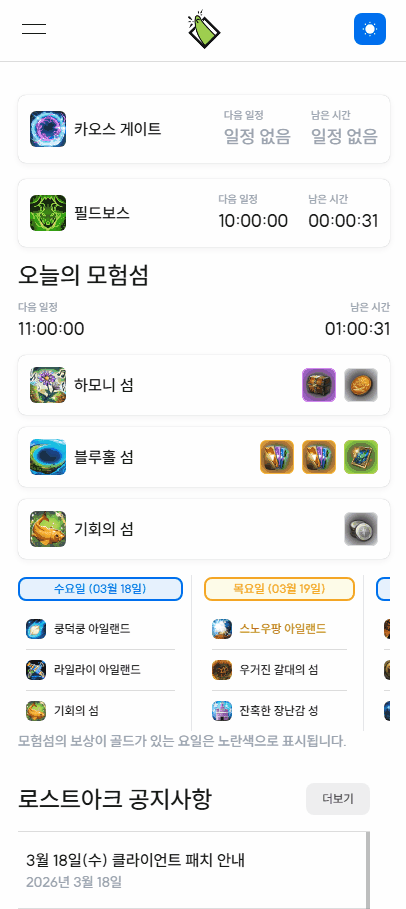
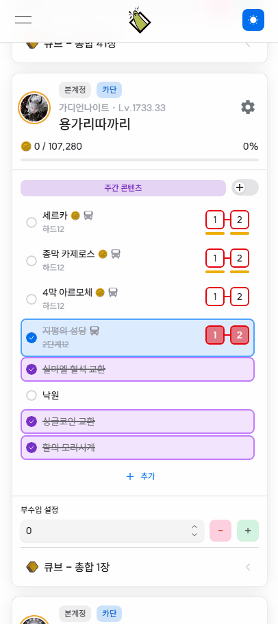
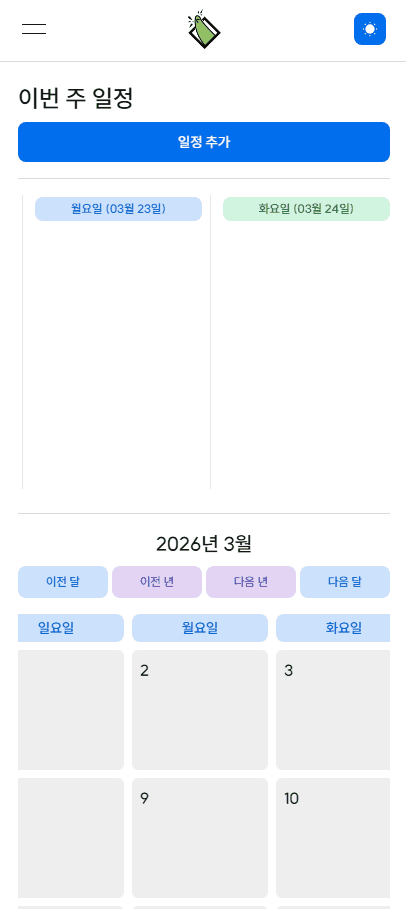
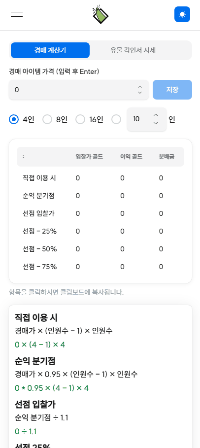
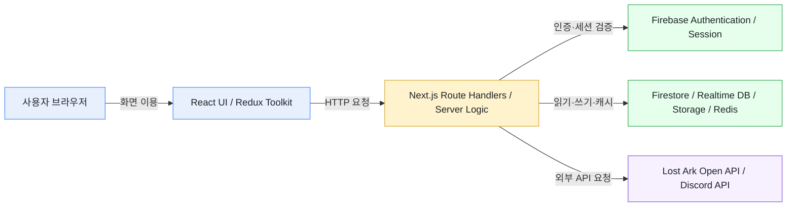
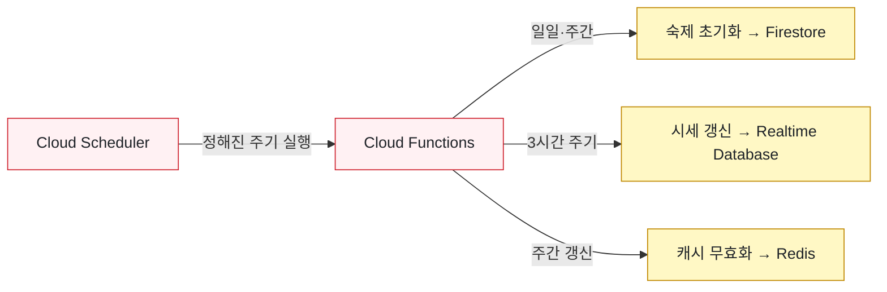

# 로츠고(Lot's Go)

> 여러 캐릭터의 숙제, 골드, 일정, 레이드 파티와 캐릭터 정보를 한곳에서 관리하는 로스트아크 통합 도구

[](https://www.lotsgo.kr)


로츠고는 다수의 캐릭터를 육성하는 과정에서 반복되는 콘텐츠 현황과 일정을 각각 인게임에서 확인하는 불편을 해결하기 위해 만든 웹 서비스입니다. 단순 체크리스트를 넘어 로스트아크 공식 API의 캐릭터·콘텐츠·시세 데이터와 사용자의 파티 및 일정을 연결해, 오늘 해야 할 일부터 원정대 성장 현황까지 하나의 흐름으로 확인할 수 있도록 설계했습니다.

## 프로젝트가 해결한 문제

| 사용자 문제 | 로츠고의 해결 방식 |
| --- | --- |
| 캐릭터가 늘어날수록 일일·주간 콘텐츠 진행 상태를 기억하기 어렵다 | 캐릭터별 체크리스트, 주간 골드와 커스텀 항목을 통합 관리 |
| 레이드 참가 일정과 개인·길드 일정이 여러 곳에 흩어진다 | 개인·길드·파티 일정을 하나의 주간/월간 캘린더로 병합 |
| 캐릭터 정보와 전투력 상승량을 확인하기 어렵다 | 전투정보실, 전투력 시뮬레이션 제공 |
| 반복 조회되는 게임 정보가 외부 API 상태와 호출 비용에 영향을 받는다 | Redis 및 Next.js 서버 캐시와 정기 갱신 작업으로 공용 데이터를 재사용 |
| 파티 운영에 필요한 모집, 숙제 확인, 일정 조율이 분리되어 있다 | 파티 생성·참가부터 멤버 현황, 모집글, 주간 일정표까지 한 흐름으로 연결 |

## 주요 기능

### 숙제와 골드 관리

- 캐릭터별 일일·주간 콘텐츠와 휴식 보너스 관리
- 아이템 레벨을 기준으로 레이드 자동 등록 및 파티 클리어 정보 기반 자동 체크
- 캐릭터/콘텐츠 필터, 메모, 커스텀 숙제와 기타 골드 내역 관리
- 레이드 골드, 더보기 비용, 큐브 티켓과 주간 획득량 집계
- 한국 시간 오전 6시 기준 일일 데이터, 수요일 오전 6시 기준 주간 데이터 초기화

### 일정과 파티 관리

- 개인·길드·파티 일정을 통합한 주간/월간 캘린더
- 레이드 파티 생성, 검색, 참가와 멤버 관리
- 파티원의 숙제 진행도 및 획득 골드 공유
- 드래그 앤 드롭 기반 주간 레이드 일정표와 모집 정보 관리
- 종료된 개인·길드 일정 자동 정리

### 전투정보실

- 로스트아크 공식 API 기반 프로필, 장비, 장신구, 각인, 보석, 카드, 아크패시브, 아크그리드 조회
- 최근 검색 기록과 등록한 원정대 캐릭터 조회
- 원정대 캐릭터를 한 화면에 모아보고 두 캐릭터의 성장 요소 비교
- 장비 재련, 품질, 장신구 옵션 등 변경에 따른 전투력 시뮬레이션
- 캐릭터별 최신 데이터 동기화와 API 응답 정규화

### 게임 편의 도구

- 경매 입찰가 및 버스비·분배금 계산기
- 유물 각인서 시세와 기간별 가격 변화 조회
- 5~10레벨 겁화·작열 보석 최저가 조회
- 재련 재료 시세를 반영한 강화 비용 최적화
- 레이드 벌금 기록, 프리셋과 최종 송금액 정산
- 초월 및 엘릭서 정제·연성 시뮬레이션

### 계정, Discord와 운영 기능

- Firebase Authentication과 자체 세션을 결합한 회원가입·로그인
- Google, Discord OAuth 회원가입·로그인 및 기존 계정 연결
- Discord 서버 입장 메시지, 로스트아크 닉네임 변경 안내, 임시 음성 채널 설정
- 관리자 권한 검증을 적용한 회원·배지·후원·주요 업데이트 관리
- 서비스 내 기능 가이드, 반응형 레이아웃, 라이트/다크 테마 지원

## 🎬 기능 미리보기
<table>
  <tr>
    <td align="center" width="25%"></td>
    <td align="center" width="25%"></td>
    <td align="center" width="25%"></td>
    <td align="center" width="25%"></td>
  </tr>
  <tr>
    <td align="center" width="25%"><b>로스트아크 정보</b></td>
    <td align="center" width="25%"><b>숙제 체크</b></td>
    <td align="center" width="25%"><b>숙제 추가</b></td>
    <td align="center" width="25%"><b>일정 관리</b></td>
  </tr>
  <tr>
    <td align="center" width="25%"></td>
    <td align="center" width="25%"></td>
    <td align="center" width="25%"></td>
    <td align="center" width="25%"></td>
  </tr>
  <tr>
    <td align="center" width="25%"><b>전투정보실</b></td>
    <td align="center" width="25%"><b>파티 레이드 추가</b></td>
    <td align="center" width="25%"><b>파티 레이드 관리</b></td>
    <td align="center" width="25%"><b>편의성 도구</b></td>
  </tr>
</table>

## 아키텍처

### 사용자 요청 흐름


```mermaid
flowchart LR
    USER[사용자 브라우저]
    UI[React UI / Redux Toolkit]
    API[Next.js Route Handlers / Server Logic]
    AUTH[Firebase Authentication / Session]
    DATA[Firestore / Realtime DB / Storage / Redis]
    EXT[Lost Ark Open API / Discord API]

    USER -->|화면 이용| UI
    UI -->|HTTP 요청| API
    API -->|인증·세션 검증| AUTH
    API -->|읽기·쓰기·캐시| DATA
    API -->|외부 API 요청| EXT

    classDef client fill:#e8f0fe,stroke:#4285f4,color:#1f2328
    classDef server fill:#fff3cd,stroke:#d4a72c,color:#1f2328
    classDef data fill:#e6ffec,stroke:#2da44e,color:#1f2328
    classDef external fill:#f6f0ff,stroke:#8250df,color:#1f2328

    class USER,UI client
    class API server
    class AUTH,DATA data
    class EXT external
```

### 예약 작업 흐름


```mermaid
flowchart LR
    SCHED[Cloud Scheduler]
    FN[Cloud Functions]
    RESET[숙제 초기화 → Firestore]
    PRICE[시세 갱신 → Realtime Database]
    CACHE[캐시 무효화 → Redis]

    SCHED -->|정해진 주기 실행| FN
    FN -->|일일·주간| RESET
    FN -->|3시간 주기| PRICE
    FN -->|주간 갱신| CACHE

    classDef scheduler fill:#fff1f3,stroke:#cf222e,color:#1f2328
    classDef job fill:#fff8c5,stroke:#bf8700,color:#1f2328

    class SCHED,FN scheduler
    class RESET,PRICE,CACHE job
```

- **프론트엔드**: App Router의 페이지와 클라이언트 컴포넌트를 분리하고, 화면 공통 상태는 Redux Toolkit, 화면 전용 상태는 기능별 훅에서 관리합니다.
- **서버 계층**: Route Handler가 인증·권한 검증, 외부 API 호출과 데이터 영속화를 담당해 클라이언트가 관리자 자격 증명과 직접 통신하지 않도록 구성했습니다.
- **데이터 계층**: 회원·체크리스트·파티처럼 관계와 변경 일관성이 중요한 데이터는 Firestore, 공용 시세 스냅샷과 일부 기준 데이터는 Realtime Database, 운영 이미지는 Firebase Storage에 저장합니다.
- **캐시·배치 계층**: 공지·이벤트·캘린더 데이터는 Redis TTL 캐시로 재사용하고, 주요 업데이트와 보스 데이터에는 Next.js 서버 캐시를 적용했습니다. 정기 작업은 시세 스냅샷 갱신, 캐시 무효화, 숙제 초기화를 담당합니다.

## 핵심 기술적 해결

### 1. 오래된 사용자 데이터까지 수용하는 정규화 계층

서비스가 운영되면서 체크리스트 스키마와 게임 콘텐츠가 계속 변경됩니다. 저장 데이터를 현재 타입으로 단정하지 않고 API 진입점에서 누락 배열, 선택 필드, 과거 필드명을 기본값과 함께 정규화했습니다. 이를 통해 신규 기능을 추가해도 기존 회원 데이터가 화면 렌더링을 중단시키지 않도록 했습니다.

### 2. 외부 API 호출을 사용자 요청과 분리

공지·이벤트·캘린더처럼 여러 사용자가 공유하는 응답은 Redis에 24시간 캐시하고, 보석과 재련 재료 시세는 Cloud Functions가 3시간마다 갱신한 스냅샷을 제공합니다. 매 요청마다 로스트아크 API를 호출하는 구조를 피함으로써 응답 편차와 외부 API 의존도를 줄였습니다.

### 3. 동시 변경이 발생하는 파티 데이터의 일관성 확보

파티 참가, 탈퇴, 일정 변경처럼 여러 문서를 함께 갱신하는 작업은 Firestore Transaction과 Batch Write로 처리합니다. 숙제 초기화처럼 대상이 많은 작업은 450개 단위로 나누어 커밋해 Firestore 배치 제한 안에서 안정적으로 수행되도록 구성했습니다.

### 4. 토큰 원문을 저장하지 않는 세션 설계

Firebase ID Token을 서버에서 검증한 뒤 짧게 사용하는 Access Token과 30일 세션을 발급합니다. Refresh Token은 `HttpOnly`, `Secure`, `SameSite=Lax` 쿠키로 전달하고 서버에는 해시만 저장합니다. 세션 만료·폐기 여부를 매 요청에서 확인하며 전체 로그아웃과 Discord OAuth 세션도 같은 세션 모델로 관리합니다.

### 5. 기능 단위로 확장 가능한 코드 구조

`checklist`, `character`, `raids`, `setting` 등 도메인별로 코드를 나누고 각 기능 내부를 `ui / lib / model`로 분리했습니다. 화면 렌더링, 이벤트·API 흐름, 도메인 타입의 책임을 구분해 대형 화면에서도 변경 범위를 좁힐 수 있도록 했습니다.

## 기술 스택

| 영역 | 기술 | 사용 목적 |
| --- | --- | --- |
| Frontend | Next.js 15, React 18, TypeScript 5 | App Router 기반 UI와 타입 안전한 기능 개발 |
| UI | Tailwind CSS 4, HeroUI, Framer Motion, next-themes | 반응형 컴포넌트, 인터랙션, 라이트/다크 테마 |
| State | Redux Toolkit, React Redux | 로그인·원정대·체크리스트·파티 공통 상태 관리 |
| Backend | Next.js Route Handlers, Firebase Admin SDK, Cloud Functions | 서버 API, 권한 검증, 예약·일괄 작업 |
| Data | Cloud Firestore, Realtime Database, Firebase Storage, Redis | 사용자 데이터, 공용 스냅샷, 이미지, 캐시 저장 |
| Integration | Lost Ark Open API, Discord API/OAuth, Axios, Cheerio | 게임 데이터 조회와 Discord 계정·서버 연동 |
| Visualization & Interaction | Recharts, dnd-kit, hello-pangea/dnd | 시세 차트와 드래그 앤 드롭 일정 관리 |
| Deployment & SEO | Vercel, Vercel Analytics, next-sitemap, JSON-LD | 배포, 사용량 확인, 검색 엔진 노출 |

## 프로젝트 구조

```text
src/
├─ app/
│  ├─ api/                # 인증, 체크리스트, 파티, Discord 등 서버 API
│  ├─ checklist/          # 숙제·골드·큐브 관리
│  ├─ calendar/           # 개인·길드·파티 일정
│  ├─ character/          # 전투정보실, 원정대, 비교·시뮬레이션
│  ├─ raids/              # 파티 모집, 멤버, 주간 일정표
│  ├─ addons/             # 계산기, 시세, 초월·엘릭서 시뮬레이션
│  ├─ setting/            # 계정, 원정대, Discord 설정
│  ├─ administrator/      # 운영자 전용 관리 기능
│  └─ store/              # Redux Toolkit 전역 상태
├─ data/                  # 로스트아크 기준 데이터
├─ Icons/                 # 공용 아이콘과 직업 엠블럼
├─ lib/                   # 서버 세션, Redis, Discord 공통 모듈
└─ utiils/                # Firebase 및 공통 유틸리티(레거시 경로 유지)

functions/
└─ src/index.ts           # 숙제 초기화, 캐시 정리, 시세 수집 작업
```

## 로컬 실행

```bash
npm install
npm run dev
```

Firebase, Redis, 로스트아크 Open API와 Discord OAuth를 사용하는 기능은 각각의 프로젝트 자격 증명이 필요합니다. 민감한 값은 저장소에 커밋하지 않고 로컬 환경 변수 또는 배포 플랫폼의 Secret으로 주입해야 합니다.

```bash
# 타입 검사
npx tsc --noEmit

# 프로덕션 빌드
npm run build
```

## 계속 개선할 부분

- 주요 계산·정규화 로직의 단위 테스트와 핵심 사용자 흐름의 E2E 테스트 자동화
- 외부 API 실패율, 캐시 적중률, 예약 작업 결과를 확인할 수 있는 운영 지표 강화
- 대량 사용자 초기화 작업을 페이지 단위 처리와 재시도 가능한 작업 구조로 확장
